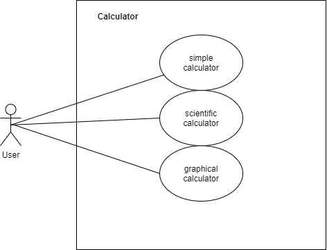

## Project Title
Calculator

## Project Abstract 
Create a calculator with graphical interface. The calculator can be used as a scientific calculator or a simple graphing calculator. 
The calculator should be able to handle simple equation such as x * y + z, x ^ y. 
The scientific calculator can calculate at least simple trigonometry function such as sin, cos, tan. 
Graphing calculator should be able to handle at least single variable function.
The calculator should be able to get input from the graphical interface or from keyboard input.

## Project relevance
The main goal of this project is to learn how to use GUI library. 
Break down some elements of the calculator into different classes. And test each class to make sure they function correctly. One of the most important elements of calculation is the order of calculation. Test case will be made to test different operation. Using GitHub to collaborate between each other. 

## Conceptual Design
Building a program using java graphical interface library. 
Create buttons for input numbers or use for mathematical operation. 
Create a class or method using for accepting input from the user. 
When user finished input, the application calls another method, to calculate the result. 
The method returns the result should know the order of operation. 
Having an area to display what is inputted or the result.
